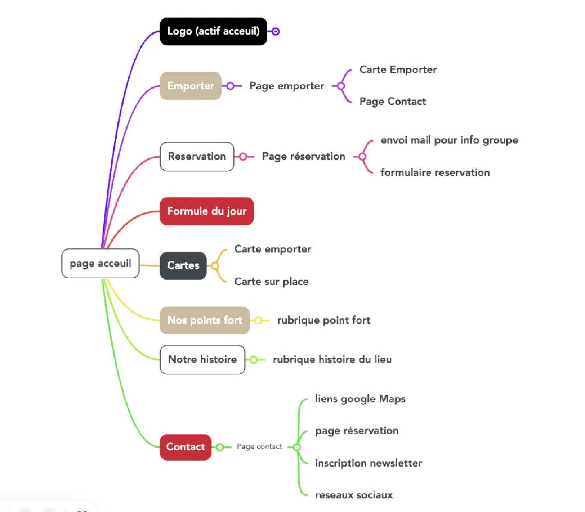
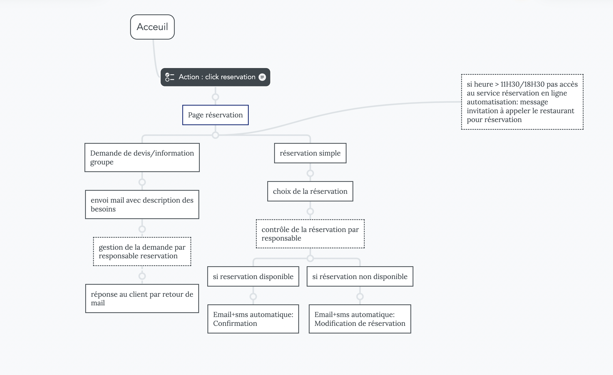

# Cahier des charges pour la réalisation du site internet du Restaurant Mama Betty

## SOMMAIRE:

### 1. Information générale

    a. information concernant le projet

    b. type de site

    c. public ciblé

    d. nom de domaine

### 2. Informations techniques

    a. contenu du site

    b. disposition du contenu

    c. plan général et disposition du site (page acceuil)

    d. schema du flux

    e. es attentes techniques

### 3. Charte graphique

    a. logo
    b. webdesign
    c. réseaux sociaux

### 4. Référencement

    a. visibilité optimale du site
    b. Piste mots clés

### Conclusion

## 1. Information générale :

	a. Information concernant le projet :
Il s’agit d’une création de site internet avec modification de logo et de la charte graphique ainsi que de la gestion de la communication digitale et marketing.

	b. Type de site :
Site vitrine et réservation en ligne auprès du restaurant ainsi que de la souscription à une newsletter pour recevoir les actualités et promotions du moment.

	c. Public ciblé :
Particuliers, entreprise, familles.

	d. Nom de domaine :
Le nom de domaine souhaité par le client : www.mamabetty.fr ; www.mama.betty.fr ; www.mamabetty.com ; www.mama.betty.com .

## 2. Informations techniques :

	a. Contenu du site :

Contenus: Textes, images, vidéo, pictogrammes.

Langue du site: Français/Anglais

Barre de menu horizontale : 6 onglets + logo actif (retour accueil) + pastille UBER EATS (lien actif vers page commande en livraison ).

            - RESERVATION
            - EMPORTER
            - CARTE
            - POINT FORT
            - HISTOIRE
            - CONTACT

'+' Accès direct : vente à emporter, réservation , formule du jour

    b. Disposition du contenu (arborescence) :

fichier arborescence

    c. Plan général et disposition du site (page d’accueil) :
    
La mise en page ci-dessous n’est qu’une piste de travail qui peut être modifiée selon le choix, remontées et suggestions utilisateurs ainsi que la validation des co-gérants du restaurant. Plusieurs propositions seront faites.

Trois objectifs à retenir :

- une ergonomie optimale pour une facilité d’utilisation.
- mise en évidence des CTA principaux pour inciter l’utilisateur à réaliser une action ( rservation, vente à emporter, formule du jour).
- une mise en page technique pertinente pour un référencement optimale du site.

    d. Schéma des fluxs

Processus de réservation pour l'utilisateur

	e. Les attentes techniques :
Site internet dynamique :

	Gestion Back-office simple
	Dépôt d’avis en ligne via les différentes plateformes
	Renvoi vers les réseaux sociaux
	Formulaire d’inscription Newsletter

Automatisation des process :

	Confirmation automatisée de la réservation par Email. (le gestionnaire de réservation doit pouvoir répondre rapidement à l’internaute de la validation ou non par mail).
	Blocage des réservations à partir de 11h30 et 18h30 (heure de debut de service) jusqu’à la fin de service. Affichage automatique d’un message invitant le client à téléphoner, car pas de réservation en ligne possible pendant le service en cours.
	Pour les réservations de plus de 10 personnes affichage automatique de renvoi vers « réservation de groupe » pour une gestion par téléphone ou demande de devis.

Géolocalisation du restaurant : 

	Sur le site internet, dans la rubrique contact, inclure une carte Google Maps pour que l’utilisateur puisse localiser le restaurant.
	Intégrer une clé API Google Maps pour que l’internaute puisse interagir avec Google Maps.

Utilisation des outils Google :

	Inscription du site sur Google analytics qui permettra de fournir des indications précieuses sur la fréquentation du site web et son efficacité en termes de marketing.

Gestion back-office :

	- Gestion des réservations
	- Gestion des demandes de devis
	- Automatisation des réponses pour facilité le travail du gestionnaire
	- Envoi des Newsletter aux clients enregistrés
	- Envoi d’Email systématique
	- Visualisation d’un tableau de réservation

Compatibilité smartphone :

Site responsive : interactif et compatible smartphone

Liens vers les réseaux sociaux :

Possibilité de poposer à l’internaute d’adhérer aux pages/groupes sur les différents réseaux sociaux.
Renvoi sur les réseaux via l’icône correspondant dans la rubrique contact (Facebook, Instagram, YouTube).

Détection IP

Géolocalisation de l’utilisateur par détection de l’adresse IP.

## 3. Charte graphique :

Reprendre la charte graphique existante et la modifier pour une meilleure identification des spécialités et qualités de l’établissement.

	a. Logo :
Modification ou création d’un logo
Effectuer les modifications en prenant comme référence couleur la planche de tendance validée par les co-dirigeants.

	b. Webdesign :
S’inspirer de la décoration du lieu et des recommandations en termes d’ergonomie, s’inspirer de la planche de tendance pour le choix des couleurs.

Prévoir le design d'une interface administrateur pour les gestions en back-office traitant les fonctionnalités demandées par le client.

Prévoir une bannière animée pour publication via le référencement GoogleAdds.

## 4. Référencement :

	a. Visibilité maximale du site dans une période très courte :
Référencement local primordial, apporter un contenu conséquent au site (instalation et renseignement des balises Title, Méta description, Alt).

Netlinking, inscription à un maximum d’annuaires avec liens vers le site, développer des partenariats et échange de liens entre professionnels.

Travailler sur le référencement du site dans les résultats Google Maps ( apparaître en haute de la page 1).

Référencement Google Ads indispensable pour placer au plus vite dans les requêtes ciblées de la restauration. 

	b. Les mots-clés :
    
Champ lexical de « la restauration » :
Restaurant, restaurants, resto, restos, restau, plat-emporter, plat-livraison, resto-groupe, resto-évenement, restaurant-groupe, diner, diner en couple, restaurant-entreprise

Champ lexical « type de cuisine »:
burger, hamburger, steak, grillades, steakhouse, burgerhouse, burger-haut de gamme, burger-qualité, cuisine américaine

Champ lexical « plats »:
viande, grillade, burger, hamberger, salade, tapas

Indication géographique :
France, Laxou, Nancy, proche Nancy, Est, Lorraine, Meurthe et Moselle

## CONCLUSION

+ Modification et mise à jour charte graphique.
+ Réalisation site internet simple et fonctionnel utilisant la nouvelle charte graphique.
+ Adapter la structure du site internet et des réseaux sociaux ainsi que la mise en forme des contenus pour un référencement optimal.
+ Gestion des réservations et du contenu Formule du jour à partir d’un back-office facile d’utilisation.
